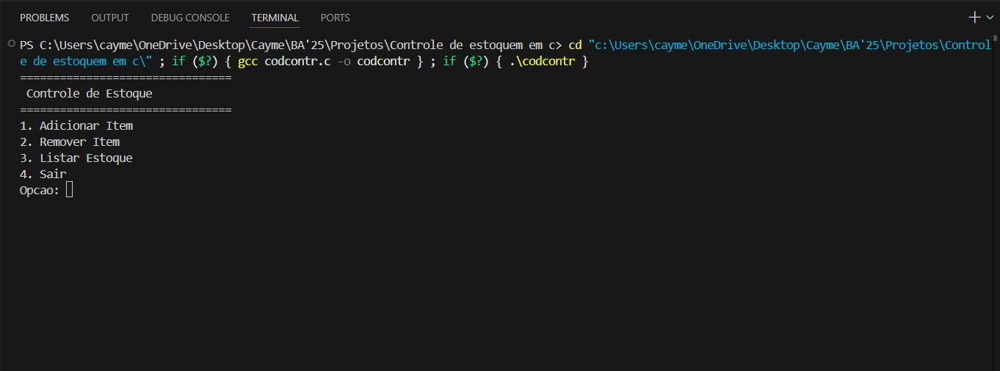

# Controle-de-estoques-em-C.
Um programa em C que simula o controle básico de um estoque. Nele é possível adicionar, remover e listar itens.

## Demonstração:

## Pré-requisitos e instalação:
- Sistema operacional: Linux, macOS ou Windows
- Compilador C (ex: GCC)
- Terminal para execução do programa
- No terminal, dentro do diretório do projeto, execute:
bash
gcc main.c -o estoque

 ## Uso e exemplos de comando:
 O usuário deve digitar o número da opção desejada e seguir as instruções exibidas no terminal.

 ## Estrutura do projeto:
├── main.c
├── images/          
└── README.md

### Como usar o projeto

Após compilar e executar o programa no terminal, será exibido um menu interativo de controle de estoque. O usuário deve escolher a operação desejada digitando o número correspondente à opção e pressionando Enter.

Para **adicionar um item**, selecione a opção `1`. Em seguida, informe o nome do item e a quantidade a ser adicionada. O item será salvo automaticamente no arquivo de estoque.

Para **remover itens**, selecione a opção `2`. O programa solicitará o nome do item e a quantidade a ser removida. Caso a quantidade informada seja maior do que a disponível em estoque, uma mensagem de erro será exibida.

Para **listar o estoque**, selecione a opção `3`. Todos os itens cadastrados e suas respectivas quantidades serão mostrados no terminal.

Para **encerrar o programa**, selecione a opção `4`. Os dados permanecem salvos para a próxima execução.

Todas as interações são feitas diretamente pelo terminal, e o arquivo `estoque.txt` é utilizado automaticamente para armazenar os dados.

## Licença  

Este projeto está licenciado sob a MIT License - veja o arquivo [LICENSE](LICENSE) para mais detalhes.  
  

